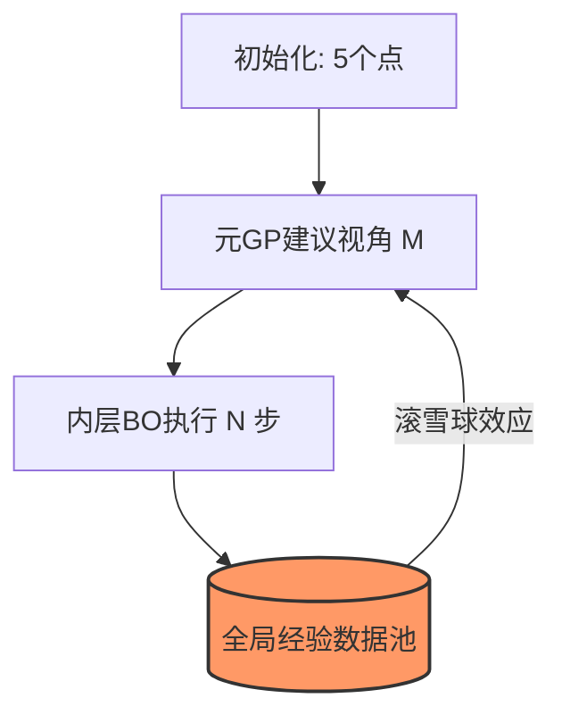
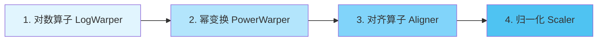

# MN-BO v3.2: “滚雪球”多视角搜索架构

## 通过有序算子链优化复杂地形

> **Antigravity 研究团队**  
> *2026-05-09*

---

## 1. 系统架构：“滚雪球”机制

### 核心逻辑：数据持久化

- **初始化**：在目标空间随机采样 5 个点作为起始池。
- **外层循环 ($M$ 轮)**：元 GP 根据历史表现，在 8 维参数空间内建议下一组变换参数。
- **内层循环 ($N$ 步)**：在选定的变换视角下，执行标准的贝叶斯优化（BO）探测。
- **滚雪球 (Snowballing)**：数据**永不重置**。每一轮新视角都会完整继承之前所有视角产生的实验数据，实现累积学习。

### 业务流程可视化

**总预算：120 步**（为确保公平对比的强约束）

---

## 2. 核心逻辑：有序算子链

### 从离散组合到连续强度控制

与其去纠结“使用哪个”算子，我们采用了一个严格有序的执行流水线，通过元参数来控制每个算子的**处理强度**。

### 执行流水线

- **有序序列**：确保数值稳定性和数学一致性（变换 -> 对齐 -> 归一化）。
- **强度控制**：将离散的“开关”转化为连续参数（例如：幂次 $\alpha$、对数阈值 $\lambda$）。

---

## 3. $M/N$ 配置的平衡艺术

MN-BO 的性能核心在于**视角广度 ($M$)** 与 **挖掘深度 ($N$)** 的比例。

| 配置类型 | 描述 | 风险 |
| :--- | :--- | :--- |
| **低 M, 高 N** | “深钻模式” | 如果初始视角选择不当，极易陷入局部最优。 |
| **高 M, 低 N** | “浅尝辄止” | GP 模型无法成熟，缺乏对局部极值的深挖能力。 |
| **稳健型 (8, 12)** | **当前推荐配置** | 在广度与深度之间取得了较好的通用平衡。 |

> [!IMPORTANT]
> 逻辑上，极小的 $M$（无法学习元规律）或极小的 $N$（无法利用局部梯度）都是站不住脚的。

---

## 4. 景观适应性

最佳配置是**函数特异性 (Function-Specific)** 的。

### 针尖型 (Needle Type)

- **地形特点**：极值区域极其狭窄。
- **策略需求**：**高 $N$ (深度)** 是关键，只有深挖才能“掉进”并精细化极值点。

### 平原型 (Plateau Type)

- **地形特点**：梯度消失，存在大片平坦区域。
- **策略需求**：**高 $M$ (视角)** 是关键，通过变换寻找能产生信号的新视角。

> **未来演进**：*自适应 MN-BO* —— 根据搜索过程中发现的地形特征（如方差、自相关性）动态调整 $M/N$ 比例。

---

## 5. 工程实践与评估体系

### 实现亮点

- **并行网格搜索**：针对 $M \times N$ 超参数空间进行大规模并行验证。
- **统计严谨性**：增加重复实验次数，以克服随机景观中的高方差问题。
- **成功率 (Success Rate)**：作为衡量算法鲁棒性的核心指标，与“绝对最大值”并列。

### 评估维度框架

| 指标 | 核心逻辑 |
| :--- | :--- |
| **绝对最大值** | 衡量该配置能达到的搜索上限（潜力）。 |
| **成功率** | 衡量在不同随机种子下的稳定性和可靠性。 |
| **收敛速度** | 达到已知最优值 95% 所需的平均步数。 |

---

## 结语

### Antigravity：探索贝叶斯优化的本质边界

*欢迎提问与讨论*
